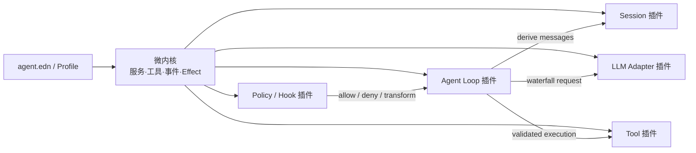

# bb-agent：Babashka 插件化 LLM Agent

这是一个用 Clojure/Babashka 实现的可扩展 coding agent。它吸收了 Pi 的小核心思路，以及 DeepSeek Harness 的 “Everything is a Plugin” 和可逆 effect 机制。

核心本身不依赖任何模型，也不包含 agent loop。模型与认证 registry、append-only session tree、资源目录、完整 coding 工具、策略、遥测、上下文管理和默认循环都是插件，可通过 EDN 重组。



## 快速运行

要求 Babashka 1.13 或更新版本。默认交互界面使用 React/Ink，还需要 Node.js 22.12 或
更新版本。首次运行先安装并构建 TUI：

```bash
npm install
bb tui-build
```

先运行完全离线的两轮工具调用示例：

```bash
bb agent --config examples/mock.edn --once "六乘七是多少？"
```

运行测试：

```bash
bb test
```

启动 DeepSeek Harness 风格的本地 WebUI（尚未安装 Node 依赖时先运行 `npm install`）：

```bash
npm install
bb web
```

WebUI 默认只监听 `127.0.0.1:3080`，启动后打开终端打印的鉴权 URL。它提供工作区白名单、
会话恢复、流式时间线、通用工具卡、远程审批、模型选择、subagent 状态和插件清单；每个打开
的会话由独立 Babashka Worker 执行，TUI 与 WebUI 共享同一份插件和 append-only session。
架构、协议、安全边界与开发命令见 [WebUI 文档](docs/webui.md)。

默认使用 Codex/ChatGPT 订阅登录：

```bash
codex login status
bb agent --once "读取 README.md 并总结这个项目"
```

默认提供 `read/write/edit/bash/grep/find/ls`；与 Pi 一致，`read` 的 `offset` 是从 1 开始的
行号，`limit` 是最大行数，另外受 `max-read-chars` 安全上限约束。未读完时结果会明确给出
已读范围、总行数和下一次应使用的 `offset`。其中写入、编辑、shell 和 `bb_repl` 必须先
通过用户 trust store 与 approval；只读工具不要求把项目标为可信。

默认 profile 还加载 OMP-inspired coding foundation 插件：`hash_read` 为完整文件生成
内容哈希快照和逐行锚点，`hash_edit` 用这些锚点批量修改并拒绝过期、错位或互相重叠的
编辑。它不会替换原来的 `edit`；非复杂小改仍可继续使用精确字符串替换。插件同时提供
`/role`，可把 `default/plan/slow/smol/advisor` 角色映射到不同 provider，配置和安全边界见
[OMP 插件文档](docs/omp-plugin.md)。

默认 profile 也启用了 DeepSeek Harness 风格的 subagent 插件族：`delegate_task` 创建完全
独立的子会话，`fork_agent` 只继承已经闭合的父会话轮次；两者支持 persona、只读工具收窄、
结构化输出以及前台/后台运行。后台任务通过 `list_agents`、`wait_agent`、
`interrupt_agent` 管理。同一批 sibling 委派可并行，但结果仍按原 tool-call 顺序回写。
子代理默认不能写文件或执行 shell，完整架构、配置和当前范围见
[Subagent 插件文档](docs/subagent-plugin.md)。

默认 profile 还声明了可选的 LSP server registry，并提供只读 `lsp_query`。它按源文件寻找
最近项目根、首次查询时才启动服务器，并在每次查询前同步当前文件；支持 diagnostics、
definition、references、hover、symbols、implementation 与 type definition。没有安装的
server 只在 `/lsp status` 显示 unavailable，不影响启动，也不会自动下载。配置、协议行为和
安全范围见 [LSP 插件文档](docs/lsp-plugin.md)。

切换到 DeepSeek：

```bash
export DEEPSEEK_API_KEY="..."
bb agent --config examples/deepseek.edn --once "读取 README.md 并总结这个项目"
```

默认 `agent.edn` 使用独立的 `agent.plugins.chatgpt` Responses adapter。它在每次请求前读取
`$CODEX_HOME/auth.json`（未设置时为 `~/.codex/auth.json`），只取 access token 与
account id，不缓存或记录 refresh token。登录失效后运行 `codex login`，无需修改
agent 配置。为防止凭据外发，adapter 只接受 ChatGPT/Codex 官方订阅后端。

此方式复用的是 Codex 的 ChatGPT 订阅登录与内部传输协议，不是按量计费的 OpenAI
API key。认证缓存位置是官方文档支持的，但订阅后端协议并不是稳定的公开 API，因而
这个 adapter 标记为 experimental；若上游协议变化，改动被隔离在该插件内。

订阅 adapter 默认使用 HTTP/1.1，并为 ChatGPT 单独维护连接客户端。TLS 握手、连接建立、
连接重置等传输错误会丢弃旧连接状态，以 400ms 起步的指数退避重试 4 次；业务错误和
取消不会重试。可通过 `:http-version`、`:connect-timeout-ms`、`:transport-retries` 与
`:retry-delay-ms` 调整。连接层重试耗尽后不会再由 runtime 成倍重放同一个请求。

不带 `--once` 会进入多轮交互模式，并自动把 session 保存到
`.bb-agent/sessions/<时间>-<ID>.jsonl`；在 session 插件设置 `:ephemeral true` 可明确关闭
自动保存。默认模型、端点、工具和插件顺序都在 `agent.edn` 中配置。OpenAI-compatible
插件也可以连接其他兼容 `/chat/completions` 的服务。Codex Responses 和 DeepSeek Chat
Completions 都会把文本 delta 立即写到终端，不再等待完整响应下载结束。

交互模式默认加载 `agent.plugins.tui-ink`：Babashka 继续持有 session、agent loop、工具与
审批，Node/React/Ink 子进程只负责全屏终端界面。当前界面按 Qwen Code 的默认暗色、
欢迎 banner、消息符号、双横线输入区与弹窗布局呈现，并包含带代码/diff 分栏预览、可即时切换的 Qwen
内置主题、session 恢复、流式
Markdown/reasoning、紧凑工具状态、多行 Unicode 输入、命令补全、输入历史、长会话虚拟滚动，
以及 model、session、theme 和审批选择器。离线体验：

```bash
bb tui-build
bb agent --config examples/tui-mock.edn --mode tui
```

Ink 子进程默认使用 `TERM=xterm-256color`、`FORCE_COLOR=1` 和
`NODE_ENV=production`，并移除从宿主继承的 `NO_COLOR`。因此 Ghostty 不需要再手工补环境变量；
生产模式也会避免长时间动画触发 Node 的 `MaxPerformanceEntryBufferExceededWarning`。

同一次模型响应里的 read/search/list 工具会聚合成一条 Qwen 风格语义摘要，例如
`Searching ToolGroup, reading README.md, listing apps/tui…`；运行中的状态图标和底部短语会动态
变化，完成后整句自动切换为过去时。命令、编辑等动作型工具仍逐条保留，`Ctrl+O` 可展开完整细节。

`Enter` 在空闲时提交、运行中 steer；`Ctrl+Q` 在运行中排入 follow-up；`Alt+Enter`、
`Ctrl+N`、`Ctrl+Enter` 或 `Shift+Enter` 插入换行；`Esc`/`Ctrl+C` 中止当前运行，
`Ctrl+O` 展开或折叠 reasoning 与工具详情，`Tab` 补全 slash command，
`PageUp/PageDown` 查看历史。向上滚动后，新消息不会强制把视口拉回底部。`/model`、
`/sessions` 和 `/theme` 打开对应选择器。完整安装、按键、命令、TTY/JSONL 架构与旧版
Clojure TUI 兼容方式见 [TUI 文档](docs/tui.md)。

默认 profile 会显示实际发生的工具调用：

```text
→ tool bb_repl {"code":"(+ 20 22)"}
? approval bb_repl allow
← tool bb_repl ok
value:
42
42
```

审批与工具过程是 trace，写到 stderr；模型文本流写到 stdout，完成后不会再重复打印最终回答。可在 profile
中把 `agent.plugins.trace` 的 `:enabled` 改为 `false` 关闭。字面量
`bb agent --once ""` 是空 prompt，会在调用模型之前被拒绝，所以不会产生任何工具过程。

```bash
bb agent --list
bb agent --help
```

## 运行中控制

交互模式不再被一次生成同步锁死。模型或工具运行时可以继续输入：`Enter` 会 steer
当前运行，`Ctrl+Q` 会排成 follow-up，也可以用 slash command 显式控制：

```text
/steer 先不要改文件，先解释根因
/follow-up 完成后再运行完整测试
/abort
/state
```

公开的 `:agent/session` service 提供 `submit!/steer!/follow-up!/abort!/state/subscribe!`；
`agent.api` 是稳定的嵌入入口。abort 会关闭 SSE、取消退避与进程，并把
`agent/aborted` 写入 session，不会持久化半条 final assistant message。

同一 assistant message 的只读工具默认并行；preflight/approval 保持模型顺序，结果始终
按原 tool-call 顺序写回。只要批中含 `write/edit/bash` 或声明为 sequential 的工具，整批
就顺序执行。

## 会话恢复、树、分叉与自动压缩

`--session` 指定 JSONL 日志；文件存在时自动恢复，不存在时创建：

```bash
bb agent --session .bb-agent/sessions/demo.jsonl --once "记住数字 42"
bb agent --session .bb-agent/sessions/demo.jsonl
bb agent --session .bb-agent/sessions/demo.jsonl --session-info
```

分叉会创建新 session id，并拒绝覆盖已有目标；压缩会保留最近消息，并追加一个
`session/compaction` checkpoint，不重写旧日志：

```bash
bb agent --session .bb-agent/sessions/demo.jsonl \
  --fork .bb-agent/sessions/experiment.jsonl
bb agent --session .bb-agent/sessions/demo.jsonl --compact
```

每个 entry 记录 parent，store 提供活动叶、name/label、`/tree` 与 `/checkout ENTRY_ID`；
session catalog 会索引 `.bb-agent/sessions/*.jsonl`。交互模式还提供 `/session`、
`/fork PATH`、`/compact` 和 `/clear`。`/clear` 也只追加
checkpoint，不再截断历史。恢复时无效 JSON 行会被跳过并出现在 `:diagnostics`，因此
进程在写入中途退出留下的半行不会毁掉整段会话。

context manager 根据 context window 与 reserve token 自动触发语义摘要，并以 append-only
checkpoint 保存；摘要失败会退回有界确定性摘要。provider 报 context overflow 时会压缩后
只重试一次；临时 provider error 的退避也可取消。手工 `:compact!` 仍可注入外部摘要。

## 执行安全

coding 工具经过四层独立能力：

- `agent.plugins.execution-world` 统一 `read!/write!/edit!/list!/search!/spawn!`，工具不直接
  访问主机；本地、容器、SSH 或测试 provider 可以整体替换。
- `agent.plugins.trust` 从用户控制的 `~/.bb-agent/trust.edn` 读取 canonical root，按最近
  父目录继承；项目自己的 `agent.edn` 不能自证可信或提前加载外置 namespace。
- `agent.plugins.approval` 可按工具、最终解析路径、cwd、命令 regex 和 provider 决策，
  支持当前 session 临时放行；审批前显示解析后的目标。
- 本地 `bash` 与 `bb_repl` 默认 `:sandbox :auto`。macOS 使用 Seatbelt 禁网并阻止读取
  工作区外用户文件；其他系统找不到安全 provider 时，agent 仍可启动并保留对话与受
  工作区约束的文件工具，但不会注册 `bash/bb_repl`。只有明确接受无隔离执行时才配置
  `:sandbox :none`。

trust store 示例（路径应使用 canonical absolute path）：

```clojure
{:roots {"/absolute/path/to/projects" :allow
         "/absolute/path/to/projects/untrusted" :deny}}
```

新项目默认不可信，Bash、写入和 `bb_repl` 会保持禁用。当前 Ink TUI 不会在启动时自动
弹出项目信任向导；用 `/trust` 查看状态，确认路径无误后用 `/trust allow` 信任，或用
`/trust deny` 明确保持受限。决定会原子写入上述用户 trust store，并立即刷新项目资源。
非交互的 `--once`、JSON/RPC 模式同样不会自行弹出确认。需要逐次确认工具时，把
`agent.edn` 中 approval `:mode` 改成 `:ask`。

## 资源、模型与外部协议

resource catalog 会发现用户级 `~/.bb-agent/`、跨 agent 的 `~/.agents/skills/`，以及项目级 `.bb-agent/` 的
`AGENTS.md`、`SYSTEM.md`、prompt 和 skill。skill 启动时只注入 name/description；模型用
`read skill://<name>` 读取完整 `SKILL.md`，并可继续读取
`skill://<name>/references/...` 等同目录资源。`load_skill` 保留为兼容入口，用户也可通过
`/skill:<name> [args]` 显式调用。YAML frontmatter、同名优先级、include/ignore、隐藏 skill
及子 Agent 继承均由 catalog 统一处理；`/reload` 先完整验证新目录再原子切换。

model registry 允许多个 adapter 同时注册 metadata，并用 `/model`、`/model PROVIDER` 或
`--provider PROVIDER` 查看和切换。auth store 每次请求动态解析 Codex cache 或环境 key，
不缓存 refresh token。

外部 UI 和 IDE 可以使用版本化 JSONL：

```bash
bb agent --config examples/mock.edn --mode json --once "六乘七是多少？"
bb agent --config examples/mock.edn --mode rpc
```

RPC 保留 prompt、steer、follow-up、abort、state、clear、compact、sessions、providers、
select-provider、reload 与 shutdown，并新增声明式、JSON Schema 校验的 Remote API，覆盖
session snapshot/cursor、turn、interaction、model、command、runtime 与 subagent。stdout 只
输出 version 1 JSON，诊断仍走 stderr。用户消息也支持 typed text/image content blocks，
ChatGPT Responses 与 OpenAI-compatible adapter 会转换成各自的多模态格式。

## 插件写法

插件是一个暴露 `plugin` map 的普通 Clojure namespace：

```clojure
(ns my.weather
  (:require [agent.kernel :as kernel]))

(def plugin
  {:id :tools/weather
   :description "Weather tool"
   :start
   (fn [ctx config]
     (kernel/register-tool!
      ctx
      {:name "weather"
       :description "Get weather by city"
       :parameters {:type "object"
                    :required ["city"]
                    :properties {"city" {:type "string"}}
                    :additionalProperties false}
       :execute (fn [{:keys [city]} execution]
                  {:city city :temperature 25})})
     nil)})
```

把 namespace 所在目录加入 `bb.edn :paths`，再在 profile 中挂载：

```clojure
{:plugins [{:ns my.weather :config {:token-env "WEATHER_TOKEN"}}]}
```

注册 service、tool、observer、interceptor 和自定义 disposer 都会形成 effect。插件卸载时，effect 按注册的逆序撤销，不会留下旧工具或事件监听器。

TUI 也是普通插件。默认 `agent.plugins.tui-ink` 通过 frontend-neutral Remote API 和
`agent.ui` prompt 边界接入，不把 React 状态塞进 agent loop。当前 Ink 界面已经处理
approval、select、confirm、input 和 custom prompt，也会投影 JSON-safe status、widget 和
notification，并通过 Remote API 调用注册在 host 的 shortcut handler。Clojure
message/entry/tool renderer 函数不能跨进程变成 React 组件，函数值字段只显示不可用占位符；
需要原生 renderer 时仍可使用兼容的 `agent.plugins.tui`。
工具仍可分别声明 `:render-model` 和 `:render-tui`，避免模型上下文文本与终端表现互相绑死；
旧 TUI 扩展示例见 `plugins/example/ui_demo.clj`。

## 设计要点

- 会话日志是模型上下文的来源；用户、assistant 和 tool message 都先写入 append-only event log，再推导下一轮 messages。
- 工具输入在执行前做 JSON Schema 校验，覆盖 composition、nullable、格式与常见
  字符串/数值/数组约束；未知字段可通过 `additionalProperties false` 拒绝。
- 工具返回 canonical JSON value，渲染成模型文本是另一层职责，避免让下游解析随意 prose。
- `:tool/pre-execute`、`:tool/execute`、`:tool/post-execute` 和 `:llm/request` 是有序 waterfall；策略无需修改 agent loop。
- `bb_repl` 工具和执行后端分离：`agent.plugins.clojure-repl` 只依赖
  `:execution/repl` service，默认 provider 是一个通过单行 EDN 协议通信的持久化
  Babashka 子进程。REPL 中的 `def` 可跨调用复用；超时后子进程会被终止并按需重建。
- `agent.cancellation` 的 token 会传到 adapter；取消会关闭 SSE transport 并记录
  `agent/aborted`。运行时同时提供 `:agent/cancel` service，供 TUI、HTTP server 或
  上层调度器调用。
- `:llm/stream` 是 provider-neutral live event；console renderer 只依赖
  `:text/delta`、`:response/completed` 和 `:response/error`，不依赖供应商 SSE 格式。
- macOS sandbox 隔离 `bash` 与 `bb_repl` 子进程。同进程插件仍继承 agent 权限；生产环境
  应审计插件来源，并在其他操作系统接入容器或远程 provider。

架构来源与插件化实践见 [调研报告](docs/research.md)；当前与 Pi 的逐项能力差距、优先级和
落地验收标准见 [Pi 差距分析](docs/pi-gap-analysis.md)。

## 目录

```text
src/agent/kernel.clj            微内核、注册表、waterfall、effect
src/agent/plugin.clj            EDN profile 与 namespace 加载器
src/agent/cancellation.clj      协作式取消 token 与资源关闭回调
src/agent/streaming.clj         provider-neutral SSE framing
src/agent/plugins/runtime.clj   默认 agent loop 插件
src/agent/plugins/execution_world.clj 统一文件与进程执行世界
src/agent/plugins/context_manager.clj token 预算、语义压缩与恢复重试
src/agent/plugins/model_registry.clj 多 provider/model 目录与选择器
src/agent/plugins/subagent.clj provider-neutral subagent registry 与生命周期
src/agent/plugins/subagent_in_process.clj 隔离的 spawn/fork provider
src/agent/plugins/subagent_tools.clj 委派与后台任务控制工具
src/agent/plugins/stdio_session.clj 长驻、可取消的 argv/stdio 进程 provider
src/agent/plugins/lsp.clj       LSP registry、JSON-RPC 与文档同步 runtime
src/agent/plugins/lsp_tools.clj 只读 lsp_query 与 /lsp 命令
src/agent/plugins/resources.clj 可信 context/prompt/skill 发现与 reload
src/agent/plugins/bb_repl.clj   持久化 Babashka 子进程 provider
src/agent/plugins/clojure_repl.clj 模型侧 bb_repl 工具
src/agent/repl_worker.clj       REPL 子进程的 EDN worker
src/agent/plugins/openai.clj    DeepSeek/OpenAI-compatible adapter
src/agent/plugins/chatgpt.clj   ChatGPT subscription/Codex auth adapter
src/agent/plugins/session.clj   可恢复、可 fork/compact 的 append-only session
src/agent/protocol.clj          version 1 JSON event 与 stdin/stdout RPC
src/agent/api.clj               稳定的公开 Clojure embedding API
src/agent/command.clj           line/TUI 共用的 slash command dispatcher
src/agent/ui.clj                可逆 UI extension 与 prompt API
src/agent/plugins/tui_ink.clj   默认 Ink 子进程、TTY/JSONL bridge 与 prompt adapter
apps/tui/                       React/Ink UI、projection、transport 与组件测试
src/agent/plugins/tui.clj       兼容的 JLine/Clojure 全屏 TUI
src/agent/plugins/*.clj         tools、trust、approval、policy、stream、trace、mock
plugins/example/math.clj        仓库外置插件示例
examples/mock.edn               无 API key 的确定性演示
examples/chatgpt.edn            复用 Codex 登录态的 ChatGPT 订阅 profile
examples/deepseek.edn            DeepSeek API profile
test/agent/test_runner.clj      契约与端到端测试
```
