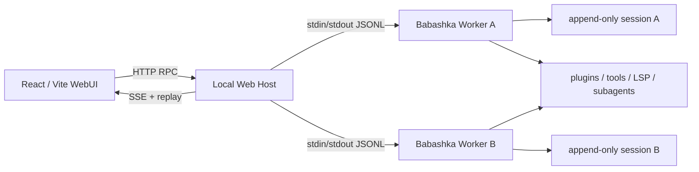

# 本地 WebUI

WebUI 采用与 DeepSeek Harness 相同的分层原则：浏览器只负责投影和交互，本地 Web Host
负责工作区与进程策略，每个打开的会话由一个独立 Babashka Worker 执行。TUI、JSON 和
WebUI 仍共享同一组插件、session log 与 agent runtime。



## 启动

需要 Babashka 1.13+、Node.js 22.12+。首次运行安装前端依赖：

```bash
npm install
bb web
```

默认监听 `127.0.0.1:3080`。启动日志会打印一个只使用一次的带 token URL；首次打开后，
Host 把随机 token 换成 `HttpOnly + SameSite=Strict` Cookie，并重定向到不含 token 的地址。
可以显式选择首个工作区或端口：

```bash
npm run web:build
npm run web:start -- --workspace /absolute/project/path --port 3080
```

WebUI 支持：

- 工作区白名单的添加、移除和切换；
- 会话目录、创建、恢复、重命名、清理与压缩；
- 持久消息、通用工具卡、实时输出、steer、follow-up 和 abort；
- provider 切换、远程审批、subagent 任务与运行时插件/工具清单；
- 桌面三栏布局、移动抽屉、键盘焦点、`prefers-reduced-motion`；
- SSE 自动重连与 Host 内事件补发，重启后由 session snapshot 重新投影。

## Worker 协议

`agent.plugins.remote-registry` 提供可逆、JSON Schema 校验的 `:remote/registry`。其他插件
注册声明式方法，`agent.protocol` 只负责 JSONL 传输与旧 RPC 方法兼容，不再集中维护所有
业务分支。默认远程方法包括：

```text
remote.methods
session.snapshot / session.events / session.rename / session.clear
session.compact / session.tree / session.fork（仅 Host 可指定目标）
turn.submit / turn.steer / turn.follow-up / turn.abort / turn.state
interaction.list / interaction.resolve
model.list / model.select
command.list / command.execute
runtime.status / subagent.status
```

`session.snapshot` 返回完整的 durable event 投影起点。每条新 session event 带单调递增的
`seq`；`session.events {after}` 可按游标补取。Worker 推送统一 event envelope：

```json
{
  "version": 1,
  "type": "event",
  "session_id": "...",
  "seq": 42,
  "event_id": "...",
  "run_id": "...",
  "event": "tool/result",
  "durable": true,
  "at": "2026-08-18T12:00:00Z",
  "data": {}
}
```

`turn.submit` 立即返回 `request_id`，最终结果以 `remote/run-result` live event 返回，因此
Host 的 HTTP 请求不需要占用到模型运行结束。

## 审批与安全边界

RPC mode 会在 approval 插件前自动插入 `agent.plugins.remote-interaction`。当策略要求审批时，
Worker 发出 `interaction/request`，阻塞的只是工具 future；浏览器通过
`interaction.resolve` 返回 allow、allow-session 或 deny。超时、Worker 退出或最后一个
SSE 客户端断开都会默认 deny。最终 policy decision 仍作为 `approval/decision` 写入 session。

Host 的边界：

- 默认仅绑定回环地址；所有 API 与静态资源（健康检查除外）都要求随机 bearer token；
- 非 GET 请求校验 `Origin`，响应启用 CSP、`nosniff`、同源 opener 与禁止 frame；
- 浏览器只能打开 allowlist 中经过 `realpath` 解析的工作区，会话路径完全由 Host 生成；
- 远程命令拒绝带任意目标路径的 `/fork`，运行时状态不会返回 context 正文或认证信息；
- session JSONL、工作区清单和凭据都不会打包进前端产物。

Web Host 是本机单用户边界，不是公网多租户服务。若显式使用 `--host` 绑定非回环地址，仍应
在受控网络和反向代理后运行。

## 测试

```bash
npm test
npm run web:build
```

`bb test` 覆盖游标、远程 registry 与异步 interaction；Node 端到端测试会在临时工作区启动
真实 Babashka Worker，验证鉴权、Origin、会话创建和 RPC。前端另经过 TypeScript 检查、
Vite production build，以及桌面和 375px 视口的实际浏览器检查。
